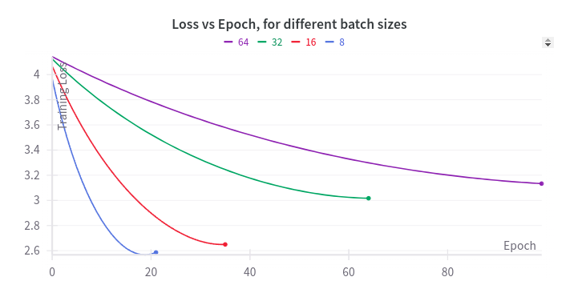
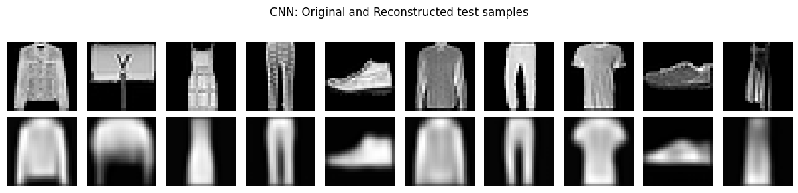

# Statistical Methods in Artificial Intelligence

## Assignment 1: K-Nearest Neighbours, Linear Regression, Regularization

<table>
    <tr>
        <td align="center"></td>
        <td align="center"></td>
        <td align="center"></td>
    </tr>
    <tr>
        <td align="center"><a href="models/knn/knn.py">Spotify Dataset</a></td>
        <td align="center"><a href="models/linear_regression/linear_regression.py">Regression Curve Fit</a></td>
        <td align="center"><a href="models/linear_regression/linear_regression.py">L2 Regularization</a></td>
    </tr>
</table>

## Assignment 2: K-Means, Gaussian Mixture Model, Principal Component Analysis, Hierarchical Clustering

<table>
    <tr>
        <td align="center"></td>
        <td align="center"></td>
        <td align="center"></td>
    </tr>
    <tr>
        <td align="center"><a href="models/k_means/k_means.py">K-Means</a></td>
        <td align="center"><a href="models/gmm/gmm.py">Gaussian Mixture Model</a></td>
        <td align="center"><a href="assignments/2/README.md">Hierarchical Clustering</a></td>
    </tr>
</table>

## Assignment 3: Multi Layer Perceptron, AutoEncoders

<table>
    <tr>
        <td align="center"></td>
        <td align="center"></td>
        <td align="center"></td>
    </tr>
    <tr>
        <td align="center"><a href="models/MLP/MLP.py">Activation Function</a></td>
        <td align="center"><a href="models/MLP/MLP.py">Learning Rate</a></td>
        <td align="center"><a href="models/MLP/MLP.py">Batch Size</a></td>
    </tr>
</table>

## Assignment 4: CNN Classification and Autoencoder

<table>
    <tr>
        <td align="center"></td>
        <td align="center"></td>
        <td align="center"></td>
    </tr>
    <tr>
        <td align="center"><a href="models/pca/pca.py">PCA Representation</a></td>
        <td align="center"><a href="models/cnn/cnn.py">CNN Representation</a></td>
        <td align="center"><a href="models/AutoEncoders/cnn_autoencoder.py">CNN Reconstruction</a></td>
    </tr>
</table>

## Assignment 5: Kernel Density Estimation, Hidden Markov Models, Recurrent Neural Networks

<table>
    <tr>
        <td align="center"></td>
        <td align="center"></td>
        <td align="center"></td>
    </tr>
    <tr>
        <td align="center"><a href="models/kde/kde.py">Kernel Density Estimation</a></td>
        <td align="center"><a href="assignments/5/README.md">MFCC Representation</a></td>
        <td align="center"><a href="assignments/5/README.md">Recurrent Neural Network</a></td>
    </tr>
</table>
