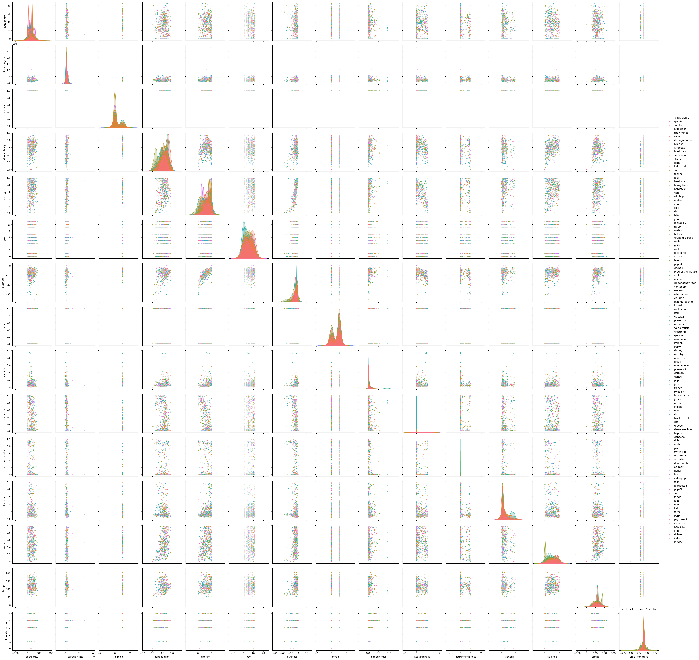
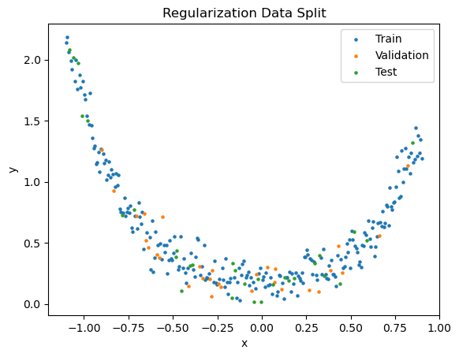
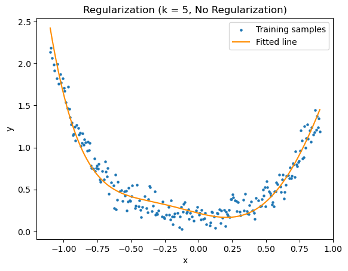

# Assignment 1 Report

## K-Nearest Neighbours

### Exploratory Data Analysis

We notice that many columns contain categorical data (track_id, artists, album_name, track_name), while many contain discretized small range values (explicit, key, mode, time_signature) that may not fit in well with the distance metric based approach like KNN.

We take the help of a pairplot to get a more refined understanding. This includes both the distributions for each attribute and the joint distribution for all pair of attributes. It is not very difficult to see that our guess for explicit, mode and time_signature stands correct, and their distributions do not seem their vary much across track genres. The same argument can be extended to liveness, acousticness and instrumentalness.



### Hyperparameter Tuning

The hyperparameter that gives the best validation accuracy for an 80:10:10 split is (13, manhattan). The top 10 hyperparameters are recorded [here](./results/knn_hyper_params.txt).

```
13, manhattan, 0.30510363271673724
17, manhattan, 0.3028749721417428
29, manhattan, 0.30142634276799646
31, manhattan, 0.30142634276799646
15, manhattan, 0.30109204368174725
23, manhattan, 0.30109204368174725
35, manhattan, 0.30109204368174725
19, manhattan, 0.3007577445954981
27, manhattan, 0.30042344550924893
25, manhattan, 0.29997771339425006
```

The k vs accuracy plot for manhattan distance is as follows.


The results for dropping various combinations of columns is recorded [here](./results/knn_drop_columns.txt).

```
('key', 'liveness', 'time_signature', 'mode', 'explicit'), 0.3244929797191888
('key', 'time_signature', 'mode', 'explicit'), 0.3241586806329396
key, 0.3153554713617116
liveness, 0.3082237575217294
('key', 'liveness', 'time_signature', 'mode', 'explicit', 'acousticness', 'instrumentalness'), 0.3063293960329842
time_signature, 0.30621796300423443
('key', 'liveness', 'time_signature', 'mode', 'explicit', 'loudness', 'speechiness'), 0.30621796300423443
None, 0.30510363271673724
mode, 0.30387786940049033
explicit, 0.30131490973924674

```

### Optimization

The inference time for different models and different dataset size is demonstrated in the following plot. Note that the initial model was too slow to run on the entire training dataset, hence remains absent in the first plot.

The initial model iterates not only over all test samples, but also over all training samples to compute distances. The optimized model iterates only over test samples, and uses matrix operations to compute all the distances in one go. The Sklearn implementation uses multi-threading to attain further speedup.


### A Second Dataset

The accuracy on test set of second dataset is recorded [here](./results/knn_second_dataset.txt). There is a drop of ~5% in accuracy, presumably due to change in class distribution.

```
13, manhattan, 0.2528206516833649
```

## Linear Regression

### Simple Regression

The split can be visualized as follows.


#### Degree 1

The evaluation metrics are recordered [here](./results/regression_line.txt).

```
Train MSE: 0.3360577892703255
Train Standard Deviation: 0.9171471721145169
Train Variance: 0.8411589353176554
Test MSE: 0.3983572844740323
Test Standard Deviation: 0.8440823210133268
Test Variance: 0.7124749646472448
```

The training points with the fitted line are as follows.


#### Degree > 1

The detailed evaluation metrics are recorded [here](./results/regression_polynomial.txt). The parameters for the best model is stored [here](./results/regression_params.npy).

```
...

k = 20
--------------------------------------------------
Train MSE: 0.010668604616247152
Train Standard Deviation: 1.0820698908872461
Train Variance: 1.1708752487647367
Test MSE: 0.009482830123196217
Test Standard Deviation: 1.0472732113856926
Test Variance: 1.0967811792861015

Observed minimum Test MSE for k = 20
Test MSE: 0.009482830123196217
```

#### Animation

Animation for selected values of k are as follows.


### Regularization

The split can be visualized as follows.



The detailed evaluation metrics are recorded [here](./results/regularization.txt).

A few selected plots for demonstration are as follows. Notice how the model without any regularization (over)fits exactly on the data, to greater extents with increasing value of k. This is in constrast to L2 regularized model, which produces a much smoother curve. On the other hand, L1 regularization produces a curve which is more "typical" of higher order polynomials, as it tends to drive several parameters to zero.




The Runge Effect is visible more clearly here, for both unregularized (to the left end) and L1 regularized (to the right end) models. The L2 model seems to fare better in this regard, atleast as far as the plotted range is concerned.


