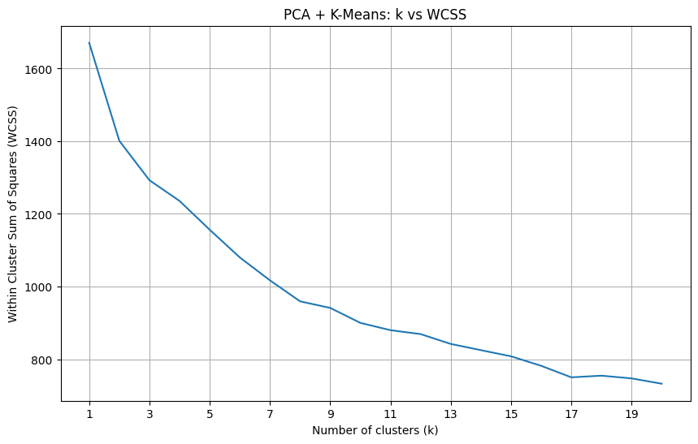
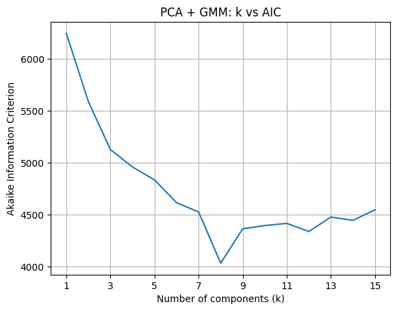

# Assignment 2 Report

## K-Means Clustering

### Optimal Number of Clusters for 512 Dimensions

The optimal number of clusters was estimated to be 6.


## Gaussian Mixture Models

### Optimal Number of Clusters for 512 Dimensions

Both the classes were found to working in the experiment performed. A sample execution is included as part of the gmm_optimal_num_clusters function. This however was not straightforward to achieve in higher dimension. As a consequence of curse of dimensionality, we require many samples in order to come up with an estimate of the underlying distribution. Random initialization of mean and covariance matrix can quickly drive the probability density to zero. However, careful initialization of model parameters based on responsibilites, yield satisfactory results.

The optimal number of clusters was estimated to be 9.


## Dimensionality Reduction and Visualization

### Data Analysis

The 2D and 3D visualization of the word embeddings, as per PCA based reduction, is as follows. The two (three) axes represent the two (three) eigenvectors with the highest eigenvalues. These can be interpreted as the axes of the highest variance in the data.


The three components, when looked in conjunction with the y(word) labels, have some nice patterns to be observed. For example, consider the first component. To the extreme right (positive values) we see verbs such as call, clean, download, cry, etc. While to the left (negative values), we see animals like crocodile, elephant, starfish. This gets even more interesting when we add the second component to picture. Look at the left of first component and the bottom (negative values) of second component, we now start seeing smaller and more domesticated animals like cat, cow, bee and ant. At the top (positive values) of second component, we see small usable items such as loudspeaker, spoon, comb and toothbrush. Interestingly, we also see a correlation between animals and the third component, but this time somewhere at the centre, around zero.

A ballpark estimate for the number of clusters, based on the 2D visualization, is 6.

## PCA + Clustering

### PCA

The optimal number of dimensions was estimated to be 15.


### PCA + K-Means Clustering

The optimal number of clusters was estimated to be 7.



### PCA + GMMs

The optimal number of clusters was estimated to be 8.




## Cluster Analysis

### K-Means Cluster Analysis

The clustering results for $k_{kmeans1}$ and $k_2$ are as follows.

```
['listen' 'flame' 'knock' 'bury' 'download' 'postcard' 'hard' 'fight'
 'call' 'hit' 'far' 'cry' 'sleep' 'clean' 'sad' 'slide' 'draw' 'pray'
 'arrest' 'email' 'buy' 'burn' 'fire' 'close' 'angry' 'lazy' 'scary'
 'hang' 'book' 'enter' 'happy' 'loud' 'love' 'cook' 'recycle' 'cut']
['mug' 'selfie' 'microwave' 'microphone' 'drink' 'calendar' 'candle'
 'oven' 'calculator' 'toothbrush' 'ambulance' 'television' 'camera'
 'loudspeaker' 'telephone' 'toothpaste' 'toaster' 'keyboard' 'radio']
['sit' 'table' 'roof' 'stairs' 'bed' 'knit' 'sweater' 'jacket' 'bench'
 'laptop' 'chair' 'ladder' 'igloo' 'pillow' 'throne' 'tent' 'lantern'
 'stove' 'suitcase']
['panda' 'ape' 'cat' 'eraser' 'eat' 'gym' 'rifle' 'cow' 'pencil'
 'starfish' 'dig' 'run' 'van' 'sun' 'feet' 'pear' 'peacock' 'fruit'
 'grape' 'ant' 'bee' 'tomato' 'parachute' 'car' 'elephant' 'pant' 'potato'
 'crocodile']
['drive' 'sing' 'rose' 'dive' 'needle' 'carrot' 'exit' 'brick' 'smile'
 'bullet' 'grass' 'brush' 'feather' 'spoon' 'bend' 'puppet' 'fly' 'face'
 'climb' 'kneel' 'scream' 'kiss' 'passport' 'catch' 'paint' 'plant'
 'notebook' 'clap' 'pull' 'cigarette' 'hollow' 'puppy' 'empty' 'flute'
 'scissor' 'door' 'mouse' 'finger' 'clock' 'envelope' 'hammer'
 'screwdriver' 'snake' 'tattoo' 'earth' 'fingerprints' 'teaspoon' 'length'
 'dustbin' 'rain' 'tank' 'key' 'swim' 'zip' 'sword' 'rainy' 'knife'
 'arrow' 'comb' 'shoe' 'walk' 'fork' 'sunny' 'paintbrush']
['deer' 'helicopter' 'fishing' 'bear' 'spider' 'shark' 'giraffe' 'forest'
 'lizard' 'frog' 'lake' 'monkey' 'baseball' 'bucket' 'boat' 'basket'
 'fish' 'saturn' 'badminton' 'goldfish' 'bird' 'spiderman' 'tree' 'beetle'
 'skate' 'airplane' 'pizza' 'dragonfly' 'butterfly' 'basketball' 'wheel'
 'bicycle' 'windmill' 'truck']
```

The clustering results for $k_{kmeans3}$ is as follows.

```
['eraser' 'table' 'carrot' 'grass' 'feather' 'spoon' 'frog' 'stairs'
 'notebook' 'bench' 'saturn' 'draw' 'mouse' 'clock' 'beetle' 'book'
 'screwdriver' 'teaspoon' 'elephant' 'cook' 'arrow' 'comb' 'fork'
 'paintbrush']
['sing' 'listen' 'flame' 'brick' 'bury' 'download' 'postcard' 'hard'
 'fight' 'call' 'kiss' 'passport' 'hit' 'bed' 'far' 'sleep' 'van'
 'microphone' 'hollow' 'clean' 'scissor' 'pray' 'email' 'pillow' 'fire'
 'close' 'lazy' 'hang' 'envelope' 'earth' 'rain' 'key' 'camera'
 'telephone' 'loud' 'rainy' 'cut' 'sunny' 'radio']
['forest' 'catch' 'paint' 'plant' 'microwave' 'baseball' 'bucket' 'basket'
 'empty' 'peacock' 'grape' 'oven' 'skate' 'toothbrush' 'ambulance' 'pizza'
 'enter' 'television' 'stove' 'basketball' 'windmill' 'toaster' 'walk']
['drive' 'panda' 'ape' 'dive' 'helicopter' 'cat' 'fishing' 'shark'
 'lizard' 'mug' 'eat' 'fly' 'gym' 'monkey' 'rifle' 'cow' 'pencil'
 'starfish' 'dig' 'run' 'clap' 'sun' 'puppy' 'sad' 'fish' 'flute' 'drink'
 'buy' 'goldfish' 'bird' 'snake' 'tattoo' 'airplane' 'swim' 'zip'
 'dragonfly' 'butterfly' 'pant' 'bicycle' 'crocodile']
['knock' 'exit' 'brush' 'climb' 'knit' 'cigarette' 'laptop' 'door'
 'badminton' 'ladder' 'arrest' 'finger' 'candle' 'igloo' 'hammer'
 'lantern' 'knife' 'keyboard']
['deer' 'rose' 'sit' 'bear' 'giraffe' 'lake' 'scream' 'boat' 'fruit'
 'calculator' 'spiderman' 'bee' 'burn' 'fingerprints' 'dustbin' 'car'
 'recycle' 'truck']
['bullet' 'kneel' 'pull' 'feet' 'pear' 'slide' 'calendar' 'ant' 'tomato'
 'parachute' 'loudspeaker' 'happy' 'love' 'toothpaste' 'potato' 'shoe'
 'suitcase']
['needle' 'smile' 'spider' 'bend' 'puppet' 'face' 'selfie' 'roof' 'cry'
 'sweater' 'jacket' 'chair' 'angry' 'scary' 'tree' 'length' 'tank'
 'throne' 'tent' 'sword' 'wheel']
```

### GMM Cluster Analysis

The clustering results for $k_{gmm1}$ is as follows.

```
['sing' 'bullet' 'giraffe' 'postcard' 'spoon' 'gym' 'lake' 'starfish'
 'baseball' 'sun' 'puppy' 'basket' 'peacock' 'slide' 'candle' 'ant'
 'igloo' 'fire' 'skate' 'snake' 'fingerprints' 'airplane' 'love']
['needle' 'brick' 'lizard' 'hard' 'passport' 'stairs' 'rifle' 'hollow'
 'clean' 'badminton' 'mouse' 'rain' 'tomato' 'radio']
['dive' 'bury' 'puppet' 'fly' 'bed' 'feet' 'pear' 'empty' 'flute' 'drink'
 'scissor' 'door' 'chair' 'finger' 'bee' 'pillow' 'tree' 'swim' 'sword'
 'toothpaste' 'shoe' 'truck' 'suitcase']
['deer' 'panda' 'listen' 'spider' 'shark' 'download' 'brush' 'mug'
 'feather' 'fight' 'cow' 'paint' 'run' 'van' 'bench' 'sad' 'grape'
 'laptop' 'draw' 'email' 'bird' 'clock' 'burn' 'lazy' 'envelope'
 'toothbrush' 'dustbin' 'car' 'loudspeaker' 'lantern' 'basketball'
 'windmill' 'toaster' 'potato' 'crocodile' 'walk']
['flame' 'bear' 'bend' 'face' 'kiss' 'selfie' 'far' 'microwave' 'cry'
 'notebook' 'clap' 'pull' 'knit' 'boat' 'calendar' 'ladder' 'beetle'
 'hammer' 'ambulance' 'stove' 'arrow']
['drive' 'rose' 'fishing' 'grass' 'climb' 'kneel' 'plant' 'cigarette'
 'microphone' 'jacket' 'bucket' 'saturn' 'earth' 'length' 'enter' 'loud'
 'knife' 'bicycle' 'recycle' 'sunny']
['sit' 'eraser' 'scream' 'hit' 'dig' 'pray' 'buy' 'goldfish' 'book'
 'teaspoon' 'pizza' 'camera' 'zip' 'dragonfly' 'happy' 'telephone' 'rainy']
['ape' 'helicopter' 'table' 'carrot' 'eat' 'frog' 'call' 'catch' 'pencil'
 'sweater' 'fish' 'fruit' 'television' 'elephant' 'wheel' 'comb' 'cut'
 'keyboard' 'fork']
['knock' 'cat' 'exit' 'smile' 'forest' 'monkey' 'roof' 'sleep' 'arrest'
 'oven' 'calculator' 'spiderman' 'close' 'angry' 'scary' 'hang'
 'screwdriver' 'tattoo' 'tank' 'throne' 'key' 'tent' 'parachute'
 'butterfly' 'pant' 'cook' 'paintbrush']
```

The clustering results for $k_2$ is as follows.

```
['deer' 'knock' 'cat' 'carrot' 'bear' 'grass' 'download' 'brush' 'spoon'
 'puppet' 'scream' 'monkey' 'roof' 'bed' 'run' 'puppy' 'empty' 'flute'
 'drink' 'draw' 'pray' 'email' 'hammer' 'snake' 'tattoo' 'earth' 'dustbin'
 'tank' 'ambulance' 'tent' 'camera' 'zip' 'dragonfly' 'car' 'telephone'
 'basketball' 'wheel' 'bicycle' 'toaster' 'keyboard' 'fork']
['rose' 'table' 'exit' 'fishing' 'spider' 'mug' 'bend' 'frog' 'fight'
 'rifle' 'cow' 'starfish' 'paint' 'plant' 'far' 'knit' 'peacock' 'saturn'
 'scissor' 'finger' 'clock' 'close' 'scary' 'hang' 'knife' 'recycle'
 'comb' 'walk' 'suitcase']
['helicopter' 'eraser' 'forest' 'call' 'face' 'kneel' 'hit' 'pencil' 'cry'
 'van' 'boat' 'grape' 'door' 'chair' 'mouse' 'candle' 'ant' 'igloo' 'bird'
 'oven' 'burn' 'angry' 'tree' 'envelope' 'book' 'teaspoon' 'enter'
 'throne' 'parachute' 'butterfly']
['panda' 'ape' 'listen' 'dive' 'shark' 'giraffe' 'lizard' 'feather'
 'postcard' 'hard' 'gym' 'lake' 'microwave' 'dig' 'notebook' 'clap'
 'cigarette' 'jacket' 'feet' 'slide' 'badminton' 'buy' 'goldfish'
 'calculator' 'spiderman' 'bee' 'pillow' 'lazy' 'skate' 'toothbrush'
 'screwdriver' 'fingerprints' 'length' 'television' 'key' 'tomato'
 'loudspeaker' 'elephant' 'pant' 'toothpaste' 'shoe' 'radio' 'truck']
['drive' 'sit' 'needle' 'bullet' 'fly' 'climb' 'kiss' 'stairs' 'catch'
 'sleep' 'sweater' 'microphone' 'baseball' 'hollow' 'bench' 'sun' 'bucket'
 'clean' 'laptop' 'fire' 'beetle' 'rain' 'sword' 'happy' 'loud' 'stove'
 'potato' 'sunny']
['sing' 'flame' 'brick' 'smile' 'bury' 'eat' 'passport' 'selfie' 'pull'
 'pear' 'basket' 'sad' 'fish' 'fruit' 'calendar' 'ladder' 'arrest'
 'airplane' 'pizza' 'swim' 'lantern' 'love' 'rainy' 'cook' 'windmill'
 'arrow' 'cut' 'crocodile' 'paintbrush']
```

The clustering results for $k_{gmm3}$ is as follows.

```
['eraser' 'table' 'carrot' 'grass' 'feather' 'spoon' 'frog' 'stairs'
 'notebook' 'bench' 'saturn' 'draw' 'mouse' 'clock' 'beetle' 'book'
 'screwdriver' 'teaspoon' 'elephant' 'cook' 'arrow' 'comb' 'fork'
 'paintbrush']
['sing' 'listen' 'flame' 'brick' 'bury' 'download' 'postcard' 'hard'
 'fight' 'call' 'kiss' 'passport' 'hit' 'bed' 'far' 'sleep' 'van'
 'microphone' 'hollow' 'clean' 'scissor' 'pray' 'email' 'pillow' 'fire'
 'close' 'lazy' 'hang' 'envelope' 'earth' 'rain' 'key' 'camera'
 'telephone' 'loud' 'rainy' 'cut' 'sunny' 'radio']
['forest' 'catch' 'paint' 'plant' 'microwave' 'baseball' 'bucket' 'basket'
 'empty' 'peacock' 'grape' 'oven' 'skate' 'toothbrush' 'ambulance' 'pizza'
 'enter' 'television' 'stove' 'basketball' 'windmill' 'toaster' 'walk']
['drive' 'panda' 'ape' 'dive' 'helicopter' 'cat' 'fishing' 'shark'
 'lizard' 'mug' 'eat' 'fly' 'gym' 'monkey' 'rifle' 'cow' 'pencil'
 'starfish' 'dig' 'run' 'clap' 'sun' 'puppy' 'sad' 'fish' 'flute' 'drink'
 'buy' 'goldfish' 'bird' 'snake' 'tattoo' 'airplane' 'swim' 'zip'
 'dragonfly' 'butterfly' 'pant' 'bicycle' 'crocodile']
['knock' 'exit' 'brush' 'climb' 'knit' 'cigarette' 'laptop' 'door'
 'badminton' 'ladder' 'arrest' 'finger' 'candle' 'igloo' 'hammer'
 'lantern' 'knife' 'keyboard']
['deer' 'rose' 'sit' 'bear' 'giraffe' 'lake' 'scream' 'boat' 'fruit'
 'calculator' 'spiderman' 'bee' 'burn' 'fingerprints' 'dustbin' 'car'
 'recycle' 'truck']
['bullet' 'kneel' 'pull' 'feet' 'pear' 'slide' 'calendar' 'ant' 'tomato'
 'parachute' 'loudspeaker' 'happy' 'love' 'toothpaste' 'potato' 'shoe'
 'suitcase']
['needle' 'smile' 'spider' 'bend' 'puppet' 'face' 'selfie' 'roof' 'cry'
 'sweater' 'jacket' 'chair' 'angry' 'scary' 'tree' 'length' 'tank'
 'throne' 'tent' 'sword' 'wheel']
```

### Comparision

## Hierarchical Clustering

Ward linkage with euclidean distance gives the cleanest clustering, in terms of inter-cluster distance. This was expected because it uses a variance minimization algorithm, merging the clusters resulting in the smallest increase in within-cluster variance.


My next favourite picks in this regard are complete and weighted linkage, with cosine distance. But the ratio between the distance at the first few levels of merging and the last few ones is lesser here compared to the first one.


## Nearest Neighbor Search

### PCA + KNN

The optimal number of dimensions was estimated to be 2.


### Evaluation

Comparision of K-Nearest Neighbours with and without PCA, based on evaluation measures is as follows.

| Measure | Without PCA | With PCA |
| --- | --- | --- |
| Accuracy | 0.305 | 0.087 |
| Precision | 0.280 | 0.089 |
| Recall | 0.286 | 0.096 |
| F1 Score | 0.283 | 0.092 |


The drastic drop in accuracy and other measures are a consequence of too small estimate using elbow point. It may be unreasonable at times to expect only two columns to capture the proximity relations between data points in high dimensional data. Notably, the accuracy scores are worse than pre-PCA case, albeit marginally, even when including all the eigenvectors. This points to two possible reasons - the number of neighbours required for the reduced dataset could be different, or the eigendecomposition may be susceptible to noise.
