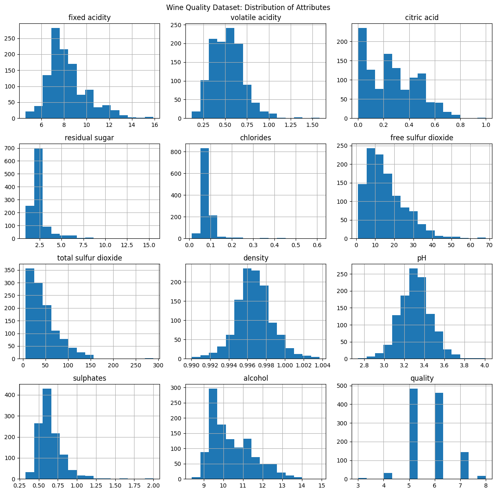
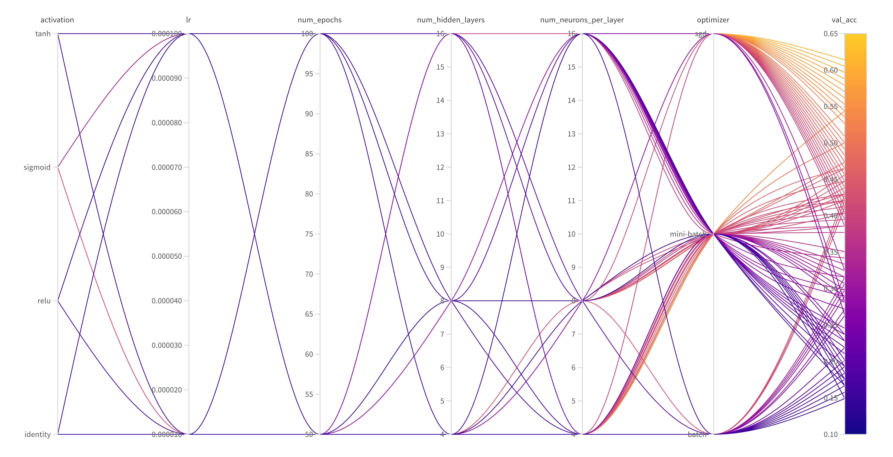
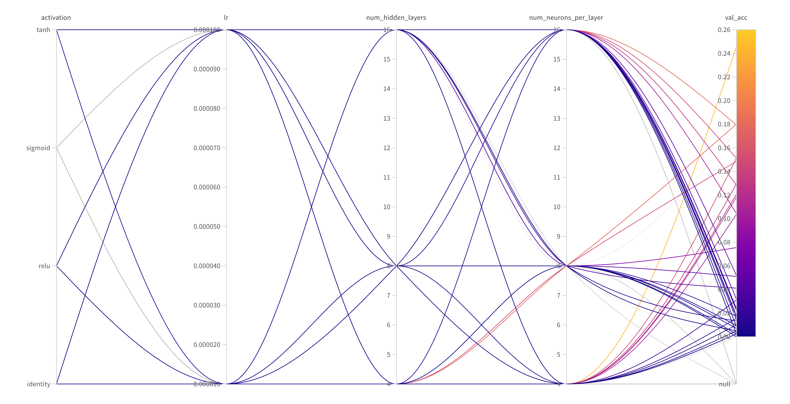
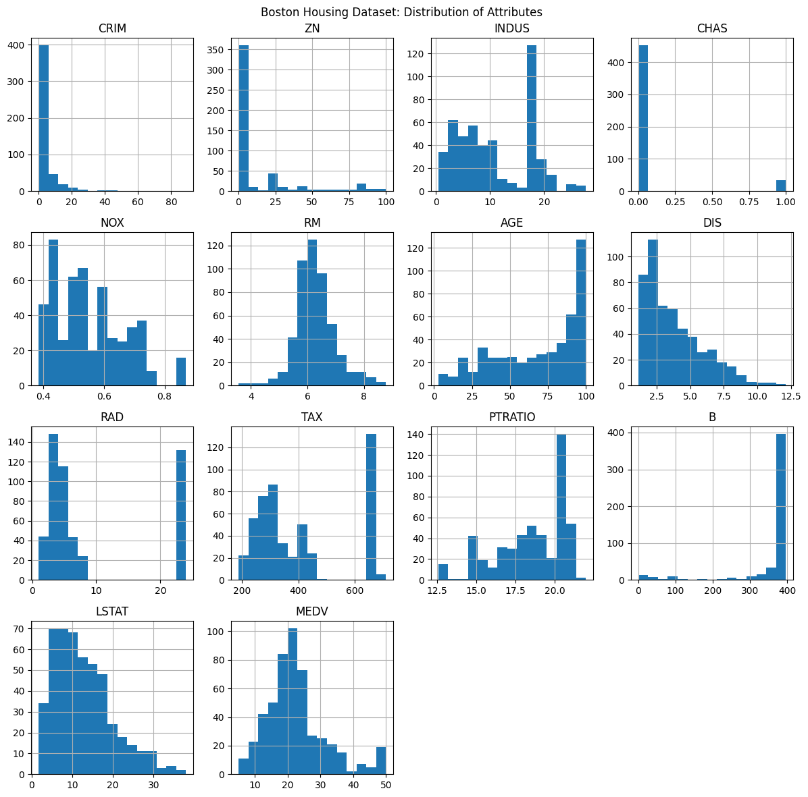
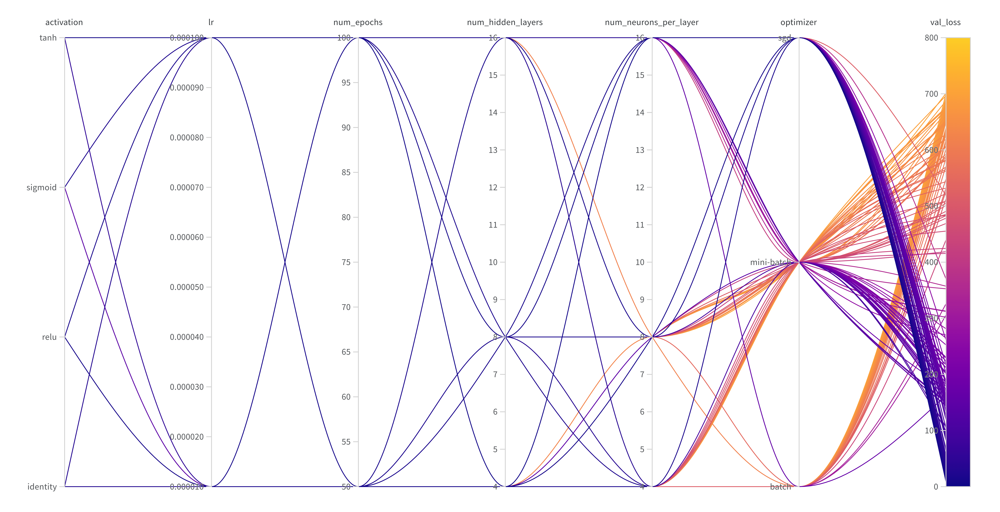
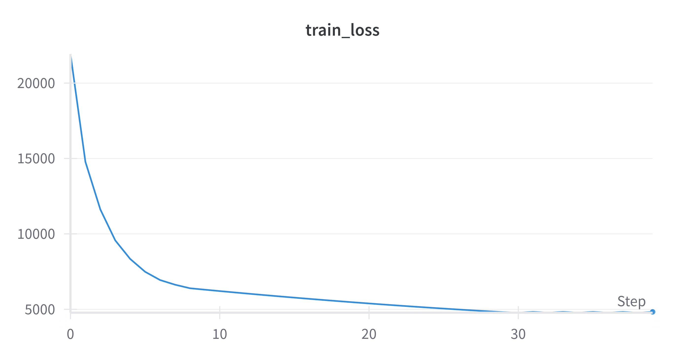
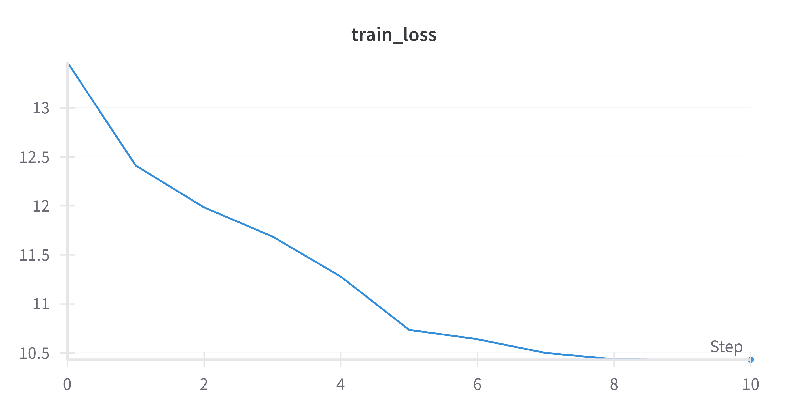

# Assignment 3 Report

## Multi Layer Perceptron Classification

### Dataset Analysis and Preprocessing

```
      fixed acidity  volatile acidity  citric acid  residual sugar  chlorides  \
mean       8.311111          0.531339     0.268364        2.532152   0.086933
std        1.747595          0.179633     0.196686        1.355917   0.047267
min        4.600000          0.120000     0.000000        0.900000   0.012000
max       15.900000          1.580000     1.000000       15.500000   0.611000

      free sulfur dioxide  total sulfur dioxide   density        pH  \
mean            15.615486             45.914698  0.996730  3.311015
std             10.250486             32.782130  0.001925  0.156664
min              1.000000              6.000000  0.990070  2.740000
max             68.000000            289.000000  1.003690  4.010000

      sulphates    alcohol   quality
mean   0.657708  10.442111  5.657043
std    0.170399   1.082196  0.805824
min    0.330000   8.400000  3.000000
max    2.000000  14.900000  8.000000
```



### Model Training & Hyperparameter Tuning using W&B



[Table listing all the hyperparameters and corresponding metrics.](./results/mlp_classification_hyperparameter_tuning.csv)

The parameters of the best model found were as follows.

```json
{
    "activation": "identity",
    "lr": 1e-4,
    "num_epochs": 100,
    "num_hidden_layers": 4,
    "num_neurons_per_layer": 8,
    "optimizer": "sgd"
}
```

### Evaluating Single-label Classification Model

```
Accuracy: 0.6608695652173913
F1 Score 0.4066757850576482
Precision 0.2976650300054556
Recall 0.6416666666666667
```

### Analyzing Hyperparameters Effects


- The sequence of loss during training is highly sensitive to the batch size. It essentially governs how much importance is given to residuals/gradients corresponding to each sample. Higher batch size leads to more averaging, shadowing the underlying losses.

- The optimization process is also sensitive to the learning rate. Too high learning rates can result in oscillations in the trajectory, making it impossible to converge. On the other hand, too slow learning rate can make the progress too slow.

- The kind of solution obtained in the optimization process is subject to the stage wise transformations introduced by the activation function. Non linear functions tend to result in better approximation, leveraging the complex composite functions learned along the way.

### Multi-Label Classification



The parameters of the best model found were as follows.

```json
{
    "activation": "identity",
    "lr": 1e-5,
    "num_epochs": 100,
    "num_hidden_layers": 16,
    "num_neurons_per_layer": 4,
    "optimizer": "sgd"
}
```

The corresponding metrics were as follows.

```
Accuracy: 0.1729285714285714
F1 Score: 0.26101386302503615
Hamming Distance: 0.3925
Precision: 0.3133333333333333
Recall: 0.22366666666666662
```

### Analysis

It is not difficult to see that the recall score on the Wine Quality dataset was much higher (twice infact!) than the precision. This demonstrates the model's bias towards predicting a small subset of values that it considers to be more probable. This was however expected owing to the target label's distribution being concentrated around just three values. This is reflected in the by and large ignorance of the model in predicting the quality to be outside this small range. We see the opposite effect in the multi-label classification case. The model was unable to see through any such exploitable pattern and chose to make more precise predictions, losing out on recall.

## Multilayer Perceptron Regression

### Data Preprocessing

```
           CRIM          ZN      INDUS      CHAS       NOX        RM  \
mean   3.611874   11.211934  11.083992  0.069959  0.554695  6.284634
std    8.720192   23.388876   6.835896  0.255340  0.115878  0.702617
min    0.006320    0.000000   0.460000  0.000000  0.385000  3.561000
max   88.976200  100.000000  27.740000  1.000000  0.871000  8.780000

             AGE        DIS        RAD         TAX    PTRATIO           B  \
mean   68.518519   3.795043   9.549407  408.237154  18.455534  356.674032
std    27.999513   2.105710   8.707259  168.537116   2.164946   91.294864
min     2.900000   1.129600   1.000000  187.000000  12.600000    0.320000
max   100.000000  12.126500  24.000000  711.000000  22.000000  396.900000

          LSTAT       MEDV
mean  12.715432  22.532806
std    7.155871   9.197104
min    1.730000   5.000000
max   37.970000  50.000000
```



### Model Training & Hyperparameter Tuning using W&B



[Table listing all the hyperparameters and corresponding metrics.](./results/mlp_regression_hyperparameter_tuning.csv)

The parameters of the best model found were as follows.

```json
{
    "activation": "tanh",
    "lr": 1e-4,
    "num_epochs": 100,
    "num_hidden_layers": 4,
    "num_neurons_per_layer": 16,
    "optimizer": "sgd"
}
```

### Evaluating Model

```
MAE: 8.397630834720651
MSE: 121.24021366598316
RMSE: 11.010913389268993
R2: -103.83659156253464
STD: 7.767371014758007
VAR: 60.33205248090284
```

### Mean Squared Error vs Binary Cross Entropy

#### Mean Squared Error



#### Binary Cross Entropy



MSE has a tendency to overvalue the residuals, while BCE undervalues the same. This is evident from their formula, with the former employing a quadratic and the latter a logarithmic function. As a result, MSE aggressively drives the far off predictions closer to the true values, comparatively ignoring the predictions that may be near the decision boundary. This also assists a quick reduction in the training loss value, as learning preferable values for selected points (contributing more to the loss) is easier than optimizing for several points at once. On the other hand, BCE can focus on consolidating the points which are near the decision boundary, effectively ignoring the outliers, thus making the classifier more robust.

### Analysis

The MSE for test dataset had strange patterns. Either the MSE would be larger than 200, or under 50 (roughly). Upon partitioning the test dataset into two by thresholding based on loss at 100, some patterns started becoming evident.

Firstly, the means of the two sets were found to be (roughly) in opposite direction to each other from the origin (note that the entire dataset was centered by virtue of being standardized).

```
[ 0.32413223,  0.48035703,  0.06080476, -0.05755949, -0.06640674, 0.14735234, -0.03870098, -0.10610219,  0.08365097,  0.27977063, 0.02823769, -0.07388913,  0.31987545]

[-0.23801784, -0.12729855, -0.14000759, -0.15381443, -0.16463406, -0.24896703, -0.13581887,  0.19128867, -0.17456645, -0.16771716, -0.13569343,  0.22079166, -0.09742463]
```

Secondly, the first set (with higher loss) was much more likely to have extremely large values. The following lists the highest value attained by a test sample at any coordinate.

```
[0.33338095, 1.6596029, 1.6596029, 4.06516024, 2.48628133, 1.61021635, 1.6596029, 3.00108685, 4.4369699, 1.17530274, 2.48628133, 2.78294677, 1.6596029, 1.02810701, 3.00108685, 3.71669834, 3.00108685, 1.47410628],

[1.61303814, 1.6596029, 1.80131641, 1.6596029, 2.7296452, 1.91038645, 0.42637632, 0.80577843, 1.6596029, 1.04015139, 1.5388905, 1.6596029, 0.71726911, 0.79657225, 0.70867176, 1.26482619, 1.26821903, 0.86429622, 0.40041648, 2.48628133, 2.12852653, 0.68446964, 1.6596029, 0.70867176, 0.42144724, 1.5388905, 3.71669834, 1.32832021, 1.85803641, 1.71042408, 0.5286352, 0.51318351, 0.89962872, 0.72820227]
```

This is despite the fact that the two sets had a comparable standard deviation, although the first one's was slighly higher. This possibly indicates that the presence of outliers in the data that were left out by the optimization process. To the contrary, it could also be a case of model not generalizing for all the present input ranges, focusing only on the dominant subspace.

## AutoEncoders

### AutoEncoder + KNN

| Measure | Original Dataset | PCA | AutoEncoder |
| --- | --- | --- | --- |
| Accuracy | 0.305 | 0.087 | 0.104 |
| F1 Score | 0.283 | 0.092 | 0.107 |
| Precision | 0.280 | 0.089 | 0.103 |
| Recall | 0.286 | 0.096 | 0.110 |

We thus demonstrate that AutoEncoders can learn better representations leveraging the network's ability to learn complex functions. The same observation from previous assignment follows that the direction of high variance may not be necessarily useful in discriminative classification tasks, thus rendering PCA less useful.

### MLP Classification

```
Accuracy: 0.16503231557833742
F1 Score: 0.20159727825446447
Precision: 0.14116899471046745
Recall: 0.35247751346742595
```

We notice a higher recall with MLP than in the case of KNN, albeit with a drop in accuracy. One may argue that the model has thus been able to get an idea of more frequent genres, enabling it to recall them more effectively. The precision has taken a hit showing that it has not been able to learn the decision boundary accurately. This may also be attributed to the fact that the original dataset had multiple genres for each track and the approximation we made by dropping multiple genres made it difficult for the model to see the underlying patterns properly.
