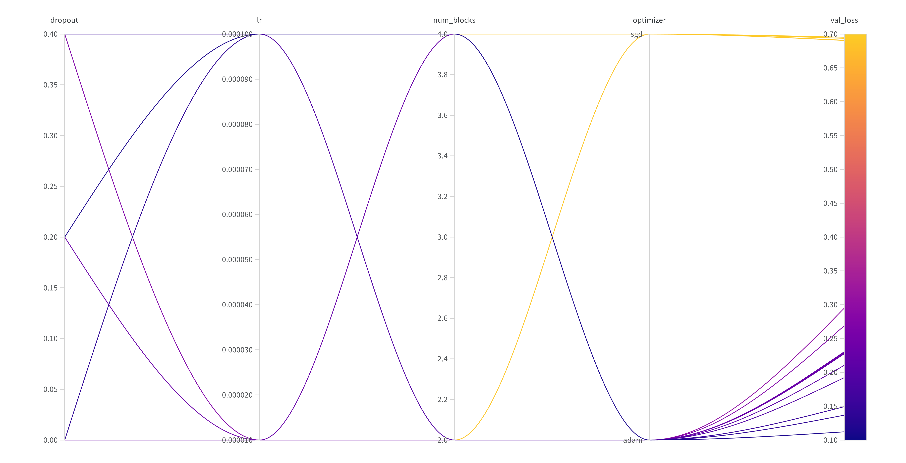
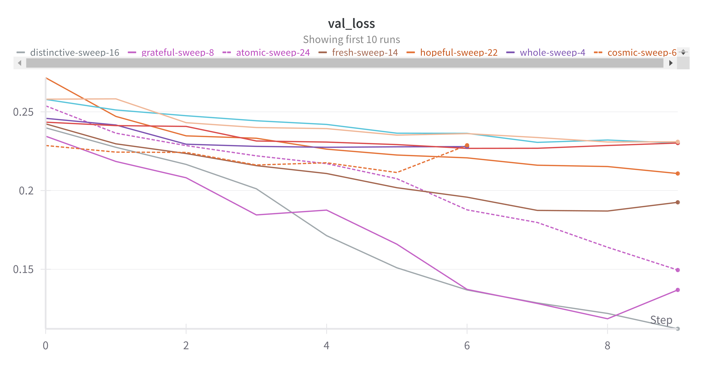
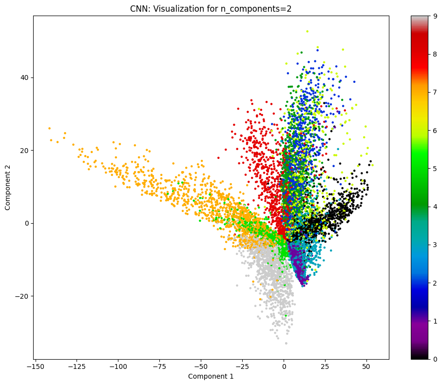
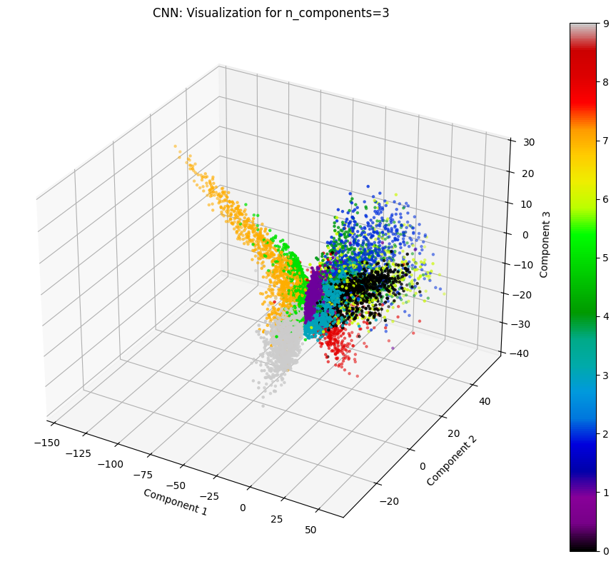
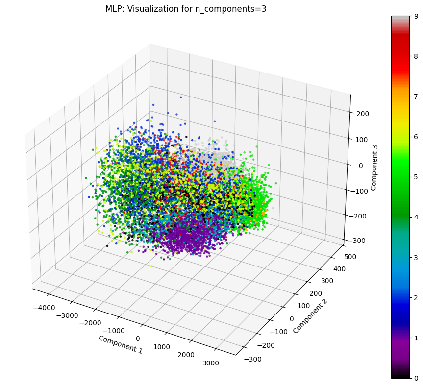
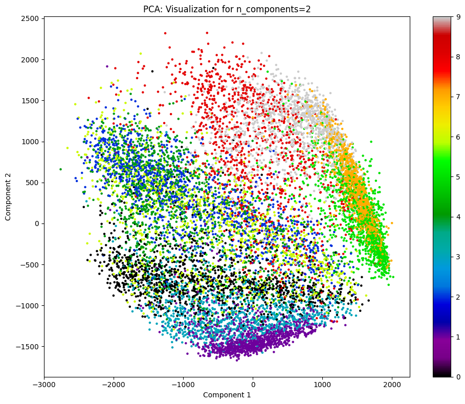
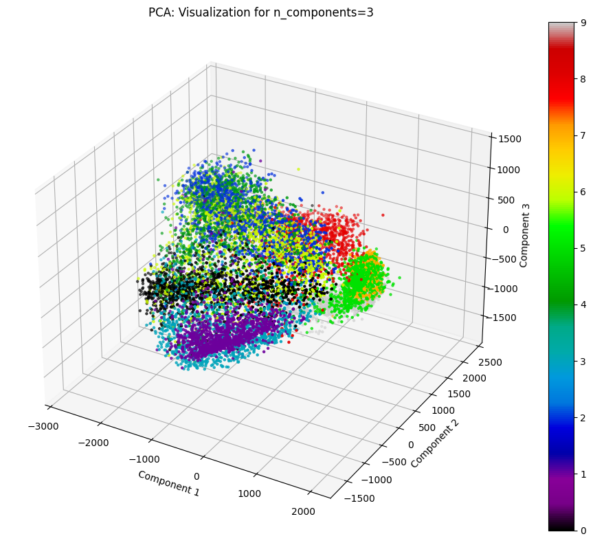
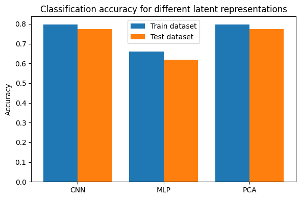

# Assignment 4 Report

## Classification Using CNN

### Hyperparameter Tuning

#### Regression


[Table listing all the hyperparameters and corresponding losses.](./results/cnn_regression_hyperparameter_tuning.csv)

The parameters and accuracy of the best model found were as follows.

```json
{
    "dropout": 0.2,
    "lr": 0.0005,
    "num_blocks": 7,
    "optimizer": "adam"
}
```

```
Validation accuracy: 1.0
Test accuracy: 1.0
```

#### Single Label Classification


[Table listing all the hyperparameters and corresponding losses.](./results/cnn_single_label_classification_hyperparameter_tuning.csv)

The parameters and accuracy of the best model found were as follows.

```json
{
    "dropout": 0.4,
    "lr": 0.00005,
    "num_blocks": 2,
    "optimizer": "adam"
}
```

```
Validation accuracy: 1.0
Test accuracy: 1.0
```

## Multi Label Classification

### Implement the MultiLabelCNN Class

The model requires a sigmoid activation after the last layer to constrain the values to lie in the (0, 1) range. They can thus represent the independent probabilities (unlike the softmax based single label classification) of a digit being present in the image.

### Hyperparameter Tuning






[Table listing all the hyperparameters and corresponding losses.](./results/cnn_multi_label_classification_hyperparameter_tuning.csv)

The parameters and accuracy of the best model found were as follows.

```json
{
    "dropout": 0.2,
    "lr": 0.0001,
    "num_blocks": 4,
    "optimizer": "adam"
}
```

```
Train exact match accuracy: 0.845634937286377
Train hamming accuracy: 0.9933121800422668
Validation exact match accuracy: 0.429666668176651
Validation hamming accuracy: 0.9737222194671631
Test exact match accuracy: 0.34217390418052673
Test hamming accuracy: 0.9685289859771729
```

## AutoEncoder: Comparative Analysis

### Dataset Analysis and Preprocessing

The classes present in the dataset are as listed below.

```python
LABEL_MAP = {
    0: 'T-shirt/Top',
    1: 'Trouser',
    2: 'Pullover',
    3: 'Dress',
    4: 'Coat',
    5: 'Sandal',
    6: 'Shirt',
    7: 'Sneaker',
    8: 'Bag',
    9: 'Ankle Boot'
}
```


### CNN AutoEncoder

#### Hyperparameter Tuning


The effect of number of layers is shown below. This relates to the general phenomena that deeper networks are harder to train. More advanced networks thus employ skip connections to allow the model to learn output through shallow connections (for simpler relations/datasets). This can also be related to the vanishing gradient concept, i.e. larger gradients can reach the first few layers of shallow networks than their deeper counterparts, and thus be optimized better.


[Table listing all the hyperparameters and corresponding losses.](./results/cnn_autoencoder_hyperparameter_tuning.csv)

The parameters and test error of the best model found were as follows.

```json
{
    "kernel_size": 3,
    "lr": 0.00001,
    "num_blocks": 3,
    "optimizer": "sgd"
}
```

```
Reconstruction error: 1879.4041074107338
```

#### Plots and Visualizations

The 2D and 3D visualization of latent space is given below. Besides the small overlap in the class points, the class distributions looks well separated and distinguishable. A few classes predominantly contribute the most to the observed overlap. For example, class indexed by 4 (coat) and 6 (shirt). As we shall see later in the classification confusion matrices, these classes tend to contribute the most to errors made by the KNN model.

```
Reconstruction error: 1818.5985827605555
```






### MLP AutoEncoder

We notice that the network is clearly overfitting on the training data and is unable to learn the true spatial relations that exist in images. This was expected since the model is fed a flattened version of the image, than the real two dimensional representation.


Based on the reconstructed images given below, one may be tempted to think that the model has not learned much about the images from the dataset. But as it will become more apparent during classification, the model's major failure is in reconstruction rather than understanding of the image. The classes may not have neat boundaries as in the case of CNN, but still provide some distinguishability.

```
Reconstruction error: 5671.708497353421
```




### PCA AutoEncoder

The optimal number of components, based on reconstruction error on validation set, is estimated to be 6.


PCA based reconstruction achieves results comparable to CNN, as the reconstruction error also affirms. However, it must be noted that the produced images lack clear boundaries and segmentation between foreground and background (notice the grey regions around the objects). The CNN, on the other hand, does a much better job, owing to its non-linearity and ability to suppress intermediate outputs.

```
Reconstruction error: 1977.5109844216408
```






### KNN Classification

CNN and PCA based classification accuracies and confusion matrices are comparable, just like their reconstruction errors were. MLP based classification gives poorer performance comparatively, on all classes except the class indexed by 7 (sneaker). The worst hit was class indexed by 8 (bag), which saw a drop in recognition by 350 (around 30%).

```
CNN Autoencoder
Train Accuracy: 0.7975952380952381
Test Accuracy: 0.7735833333333333

MLP Autoencoder
Train Accuracy: 0.6592380952380953
Test Accuracy: 0.6193333333333333

PCA Autoencoder
Train Accuracy: 0.7972619047619047
Test Accuracy: 0.7736666666666666
```




