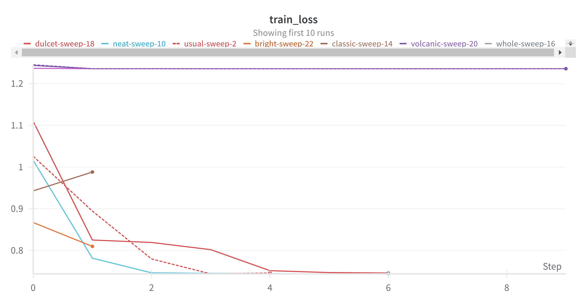

# Assignment 4 Report

## Classification Using CNN

### Hyperparameter Tuning

#### Regression


[Table listing all the hyperparameters and corresponding losses.](./results/cnn_regression_hyperparameter_tuning.csv)

The parameters and accuracy of the best model found were as follows.

```json
{
    "dropout": 0.2,
    "lr": 0.0005,
    "num_blocks": 7,
    "optimizer": "adam"
}
```

```
Validation accuracy: 1.0
Test accuracy: 1.0
```

#### Single Label Classification





[Table listing all the hyperparameters and corresponding losses.](./results/cnn_single_label_classification_hyperparameter_tuning.csv)

The parameters and accuracy of the best model found were as follows.

```json
{
    "dropout": 0.4,
    "lr": 0.00005,
    "num_blocks": 2,
    "optimizer": "adam"
}
```

```
Validation accuracy: 1.0
Test accuracy: 1.0
```

## Multi Label Classification

### Implement the MultiLabelCNN Class

The model requires a sigmoid activation after the last layer to constrain the values to lie in the (0, 1) range. They can thus represent the independent probabilities (unlike the softmax based single label classification) of a digit being present in the image.

### Hyperparameter Tuning


[Table listing all the hyperparameters and corresponding losses.](./results/cnn_multi_label_classification_hyperparameter_tuning.csv)

The parameters and accuracy of the best model found were as follows.

```json
{
    "dropout": 0.4,
    "lr": 0.0001,
    "num_blocks": 4,
    "optimizer": "adam"
}
```

```
Train exact match accuracy: 0.8263491988182068
Train hamming accuracy: 0.9767618775367737
Validation exact match accuracy: 0.6303333044052124
Validation hamming accuracy: 0.9467333555221558
Test exact match accuracy: 0.5810869336128235
Test hamming accuracy: 0.9422174096107483
```

## AutoEncoder: Comparative Analysis

### CNN AutoEncoder

#### Plots and Visualizations

#### Hyperparameter Tuning

### MLP AutoEncoder

### PCA AutoEncoder

### KNN Classification


