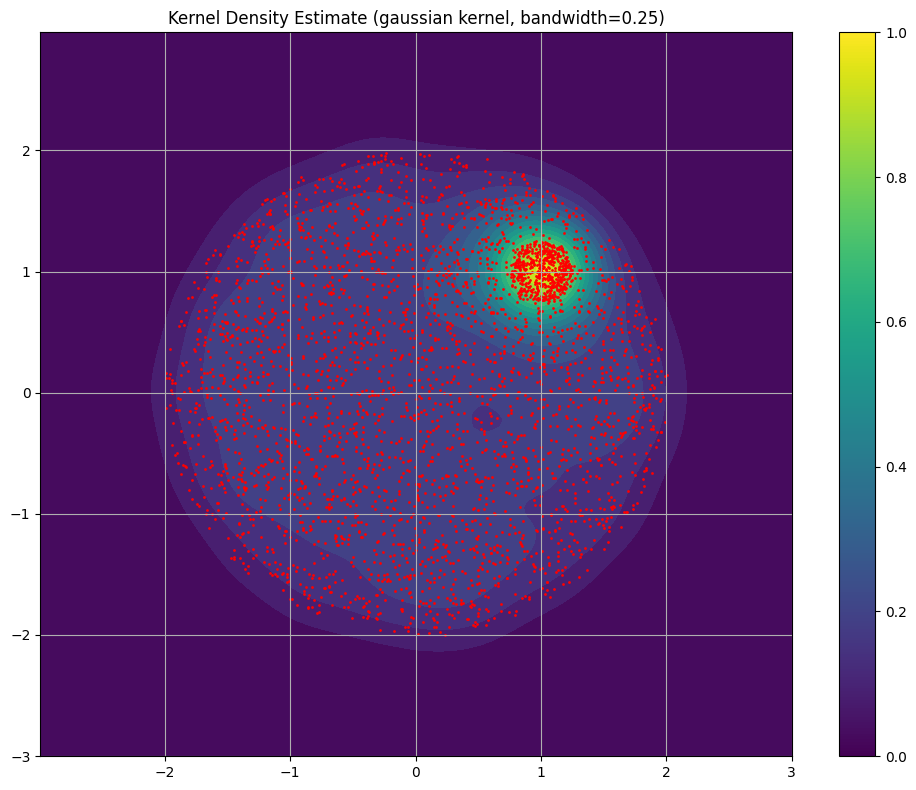
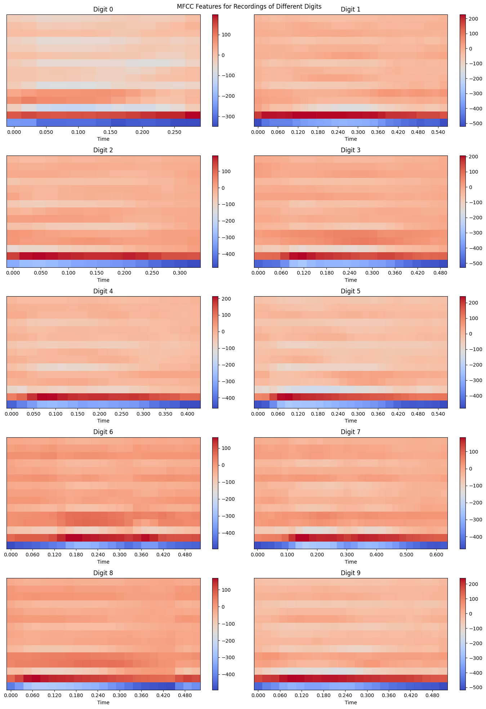
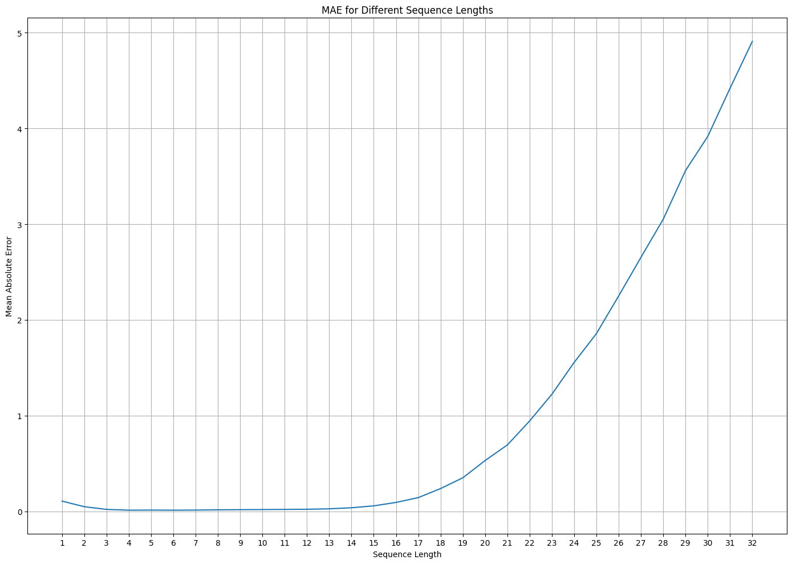

# Assignment 5 Report

## KDE

### KDE vs GMM




KDE model consistently fits the data, while the GMM is dependent on the choice of number of components (besides the random initialization). When the number of components is two, it rightly predicts the two components to be distributed around the smaller and bigger circles. However, when the number of components is set higher, it tends to further divide the bigger circle to multiple distributions with a visible boundary which is not true.

## HMMs

### Dataset




Speech signals are inherently time varying and do not have long range dependencies. For example, the word 'three' in a spoken digit sequence 'one two three' has no dependency on 'two'. The same explanation can be extended to syllables. It is thus natural to relate this with Markov models. Besides, learning of several probability distributions with hidden states allows accomodation of variability in input sequences. One may observe both small shifts and short range temporal relations in the spectogram to validate the arguments made here.

### Metrics

```
Accuracy on test set: 0.8466666666666667
Accuracy on personal set: 0.2
```

The model clearly fails to generalize to voices not in the dataset. This was expected since the dataset consists of audio produced by merely six speakers.

## RNNs

### Counting Bits

#### Dataset

A few example sequences from the generated dataset are as follows.

```
Example sequences:
[1, 1, 0, 1, 1, 0, 0, 1, 1] 6
[1] 1
[0, 1, 0, 1] 2
```

#### Training

The comparision of the model output against random baseline is as follows.

```
Test MAE: 0.033774947106933136
Random MAE: 5.530951433121019
```

#### Generalization



The model predicts reasonably well for the [1, 16] range present in the training set, but fails to generalize beyond the same. The prediction error grows exponentially with increase in sequence length beyond 16.

### Optical Character Recognition

#### Training

We notice a difference in ground truth and prediction in the first epoch, which gets rectified in the training during second epoch.

```
Epoch 1, Train Loss: 1.1330148339509964, Validation Loss: 0.3995721045952694, Average Number of Correct Characters: 6.4148
Example predictions:
Actual: flunkyize, Prediction: flnkyize
Actual: imperate, Prediction: imperate
Actual: intersterile, Prediction: intersterile
Epoch 2, Train Loss: 0.2591480255484581, Validation Loss: 0.18350919867586937, Average Number of Correct Characters: 7.6499
Example predictions:
Actual: flunkyize, Prediction: flunkyize
Actual: imperate, Prediction: imperate
Actual: intersterile, Prediction: intersterile
```

The comparision of the model output against random baseline is as follows.

```
Average Number of Total Characters: 9.4672
[Prediction] Average Number of Correct Characters: 8.6161
[Prediction] Accuracy: 0.9101
[Baseline] Average Number of Correct Characters: 0.3632
[Baseline] Accuracy: 0.0384
```
